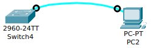
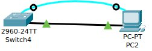
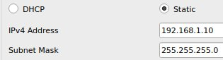

# Лабораторная работа. Базовая настройка коммутатора

## Часть 1. Создание сети и проверка настроек коммутатора по умолчанию
### 1.a. Подсоедините консольный кабель, как показано в топологии


Откроем terminal PC и посмотрим подключенные устройства:
```
Switch Ports Model              SW Version            SW Image
------ ----- -----              ----------            ----------
*    1 26    WS-C2960-24TT-L    15.0(2)SE4            C2960-LANBASEK9-M
 
Cisco IOS Software, C2960 Software (C2960-LANBASEK9-M), Version 15.0(2)SE4, RELEASE SOFTWARE (fc1)
```

### 1.b. Почему нужно использовать консольное подключение для первоначальной настройки коммутатора? Почему нельзя подключиться к коммутатору через Telnet или SSH?
Для подключения к устройству через **Telnet** или **SSH** используются **линии виртуального терминала (VTY)**, которые необходимо настраивать. Изначально ни одна из линий **VTY** не настроена, следовательно, подключиться к устройсту по протоколам **Telnet** или **SSH** не получится. По этой причине для первоначальной настройки устройства необходимо использовать консольный кабель (**RS232**).

### 2.b. Изучите текущий файл running configuration.
- Сколько интерфейсов FastEthernet имеется на коммутаторе 2960?
```
Switch# show running-config | include interface FastEthernet
```
или
```
Switch# show running-config | section FastEthernet
```
Output:
```
interface FastEthernet0/1
interface FastEthernet0/2
interface FastEthernet0/3
interface FastEthernet0/4
interface FastEthernet0/5
interface FastEthernet0/6
interface FastEthernet0/7
interface FastEthernet0/8
interface FastEthernet0/9
interface FastEthernet0/10
interface FastEthernet0/11
interface FastEthernet0/12
interface FastEthernet0/13
interface FastEthernet0/14
interface FastEthernet0/15
interface FastEthernet0/16
interface FastEthernet0/17
interface FastEthernet0/18
interface FastEthernet0/19
interface FastEthernet0/20
interface FastEthernet0/21
interface FastEthernet0/22
interface FastEthernet0/23
interface FastEthernet0/24
```
На коммутаторе 2960 имеется 24 FastEthernet интерфейса.

- Сколько интерфейсов GigabitEthernet имеется на коммутаторе 2960?
```
Switch# show running-config | include interface GigabitEthernet
```
или
```
Switch# show running-config | section GigabitEthernet
```
Результат:
```
interface GigabitEthernet0/1
interface GigabitEthernet0/2
```
На коммутаторе 2960 имеется 2 GigabitEthernet интерфейса.

- Каков диапазон значений, отображаемых в vty-линиях?
```
Switch# show running-config | section vty
```
Output:
```
line vty 0 4
 login
line vty 5 15
 login
```
Диапазон значений в vty-линиях равен 16 (от 0 до 15 включительно).

### 2.c. Изучите файл загрузочной конфигурации (startup configuration), который содержится в энергонезависимом ОЗУ (NVRAM). Почему появляется это сообщение?
```
Switch# show startup-config
```
Output:
```
startup-config is not present
```
Данное сообщение говорит об отсутствии файла config.text, содержащий загрузочную конфигурацию устрйоства. Причины могут быть следующие:

- коммутатор был быть включен впервые
- коммутатор был быть перезагружен после сбоя
- файл был удален администратором

В нашем случае отсутствие файла конфигурации обусловлено тем, что устройство было включено вперые.

### 2.d. Изучите характеристики SVI для VLAN 1.
- Назначен ли IP-адрес сети VLAN 1? Какой MAC-адрес имеет SVI? Данный интерфейс включен?
```
Switch#show interface vlan1
```
Output:
```
Vlan1 is administratively down, line protocol is down
  Hardware is CPU Interface, address is 000d.bda9.8b0c (bia 000d.bda9.8b0c)
  MTU 1500 bytes, BW 100000 Kbit, DLY 1000000 usec,
     reliability 255/255, txload 1/255, rxload 1/255
  Encapsulation ARPA, loopback not set
  ARP type: ARPA, ARP Timeout 04:00:00
  Last input 21:40:21, output never, output hang never
  Last clearing of "show interface" counters never
  Input queue: 0/75/0/0 (size/max/drops/flushes); Total output drops: 0
  Queueing strategy: fifo
  Output queue: 0/40 (size/max)
  5 minute input rate 0 bits/sec, 0 packets/sec
  5 minute output rate 0 bits/sec, 0 packets/sec
     1682 packets input, 530955 bytes, 0 no buffer
     Received 0 broadcasts (0 IP multicast)
     0 runts, 0 giants, 0 throttles
     0 input errors, 0 CRC, 0 frame, 0 overrun, 0 ignored
     563859 packets output, 0 bytes, 0 underruns
     0 output errors, 23 interface resets
     0 output buffer failures, 0 output buffers swapped out
```
Можно увидеть, что в выводе отстуствует строчка **Internet address is <ip_address>/<subnet>**. На основании этого можно сделать вывод, что IP адрес для VLAN1 не назначен. 
Запись **"Vlan1 is administratively down"** говорит о том, что данный интерфейс не включен. 
SVI имеет MAC-адрес 000d.bda9.8b0c

❓Вопрос преподавателю: Способа лучне не нашел. Существует ли более простой путь посмотреть эти настройки и убедиться в том, что IP адрес не назначен?

Можно выполнить команду 
```
Switch# show running-config
```
Output:
```
...
interface Vlan1
 no ip address
 shutdown
...
```
Но в данном выводе ничего нет про MAC-адрес.

### 2.e. Изучите IP-свойства интерфейса SVI сети VLAN 1. Какие выходные данные вы видите?
Выполним команду:
```
Switch#show ip interface vlan1
```
Output:
```
Vlan1 is administratively down, line protocol is down
  Internet protocol processing disabled
```
Видим такой результат, посколько VLAN 1 не настроен. 

Пример вывода для настроенного VLAN 1:
```
Vlan1 is up, line protocol is down
  Internet address is 192.168.1.1/24
  Broadcast address is 255.255.255.255 
  Address determined by setup command 
  MTU is 1500 bytes 
  Helper address is not set
  Directed broadcast forwarding is disabled 
  Outgoing access list is not set 
  Inbound  access list is not set 
  Proxy ARP is enabled 
  Local Proxy ARP is disabled 
  Security level is default 
  Split horizon is enabled 
  ICMP redirects are always sent 
  ICMP unreachables are always sent 
  ICMP mask replies are never sent 
  IP fast switching is disabled 
  IP fast switching on the same interface is disabled 
  IP Null turbo vector 
  IP multicast fast switching is disabled 
  IP multicast distributed fast switching is disabled 
  IP route-cache flags are None 
  Router Discovery is disabled 
  IP output packet accounting is disabled 
  IP access violation accounting is disabled 
  TCP/IP header compression is disabled 
  RTP/IP header compression is disabled 
  Probe proxy name replies are disabled 
  Policy routing is disabled 
  Network address translation is disable 
  WCCP Redirect outbound is disabled 
  WCCP Redirect inbound is disabled 
  WCCP Redirect exclude is disabled 
  BGP Policy Mapping is disabled 
```
### 2.f. Подсоедините кабель Ethernet компьютера PC-A к порту 6 на коммутаторе и изучите IP-свойства интерфейса SVI сети VLAN 1. Дождитесь согласования параметров скорости и дуплекса между коммутатором и ПК. Какие выходные данные вы видите?


На консоли будет отображено сообщение:
```
%LINK-5-CHANGED: Interface FastEthernet0/6, changed state to up

%LINEPROTO-5-UPDOWN: Line protocol on Interface FastEthernet0/6, changed state to up
```
### 2.g. Изучите сведения о версии ОС Cisco IOS на коммутаторе. Под управлением какой версии ОС Cisco IOS работает коммутатор? Как называется файл образа системы? Какой базовый MAC-адрес назначен коммутатору?
Выполним команду:
```
Switch# show version
```
Результат (удалив лишнее, получим следующее):
```
Cisco IOS Software, C2960 Software (C2960-LANBASEK9-M), Version 15.0(2)SE4, RELEASE SOFTWARE (fc1) # Операционная система
System image file is "flash:c2960-lanbasek9-mz.150-2.SE4.bin" # Файл образа системы
Base ethernet MAC Address       : 00:0D:BD:A9:8B:0C # MAC-адрес коммутатора
```
### 2.h. Изучите свойства по умолчанию интерфейса FastEthernet, который используется компьютером PC-A.
Выполним команду:
```
Switch# show interface f0/6
```
Результат:
```
FastEthernet0/6 is up, line protocol is up (connected)
  Hardware is Lance, address is 000c.85d9.8206 (bia 000c.85d9.8206)
 BW 100000 Kbit, DLY 1000 usec,
     reliability 255/255, txload 1/255, rxload 1/255
  Encapsulation ARPA, loopback not set
  Keepalive set (10 sec)
  Full-duplex, 100Mb/s
  input flow-control is off, output flow-control is off
  ARP type: ARPA, ARP Timeout 04:00:00
  Last input 00:00:08, output 00:00:05, output hang never
  Last clearing of "show interface" counters never
  Input queue: 0/75/0/0 (size/max/drops/flushes); Total output drops: 0
  Queueing strategy: fifo
  Output queue :0/40 (size/max)
  5 minute input rate 0 bits/sec, 0 packets/sec
  5 minute output rate 0 bits/sec, 0 packets/sec
     956 packets input, 193351 bytes, 0 no buffer
     Received 956 broadcasts, 0 runts, 0 giants, 0 throttles
     0 input errors, 0 CRC, 0 frame, 0 overrun, 0 ignored, 0 abort
     0 watchdog, 0 multicast, 0 pause input
     0 input packets with dribble condition detected
     2357 packets output, 263570 bytes, 0 underruns
     0 output errors, 0 collisions, 10 interface resets
     0 babbles, 0 late collision, 0 deferred
     0 lost carrier, 0 no carrier
     0 output buffer failures, 0 output buffers swapped out
```

- Интерфейс включен или выключен?
На основе строки **FastEthernet0/6 is up, line protocol is up (connected)** можно сделать вывод что интерфейс включен.

- Что нужно сделать, чтобы включить интерфейс?
Для этого нужно выполнить следующие команды:
```
Switch# configure terminal
Switch(config)# interface f0/6
Switch(config-if)# no shutdown
```

- Какой MAC-адрес у интерфейса?
000c.85d9.8206

- Какие настройки скорости и дуплекса заданы в интерфейсе?
Скорость - **BW 100000 Kbit**
Полный (двусторонний) дуплекс - **Full-duplex, 100Mb/s**

### 2.i. Изучите параметры сети VLAN по умолчанию на коммутаторе. Какое имя присвоено сети VLAN 1 по умолчанию? Какие порты расположены в сети VLAN 1? Активна ли сеть VLAN 1?
```
Switch# show vlan
```
Output (только для **default**):
```
VLAN Name                             Status    Ports
---- -------------------------------- --------- -------------------------------
1    default                          active    Fa0/1, Fa0/2, Fa0/3, Fa0/4
                                                Fa0/5, Fa0/6, Fa0/7, Fa0/8
                                                Fa0/9, Fa0/10, Fa0/11, Fa0/12
                                                Fa0/13, Fa0/14, Fa0/15, Fa0/16
                                                Fa0/17, Fa0/18, Fa0/19, Fa0/20
                                                Fa0/21, Fa0/22, Fa0/23, Fa0/24
                                                Gig0/1, Gig0/2
```


- К какому типу сетей VLAN принадлежит VLAN по умолчанию?

  Представляет собой виртуальную локальную сеть. Default VLAN (VLAN по умолчанию) - VLAN, в котором находятся все порты коммутатора перед началом конфигурирования. VLAN по умолчанию для коммутаторов Cisco - VLAN1 ([источник](https://mcp1971.livejournal.com/1851.html)).
❓Вопрос преподавателю: Что можно почитать на тему типов VLAN? Погуглил, но информации на тему **Default VLAN** относится к такому-то типу не нашел.

### 2.j. Изучите флеш-память. Какое имя присвоено образу Cisco IOS?
```
Switch# show flash
```
Output:
```
Directory of flash:/

    1  -rw-     4670455          <no date>  2960-lanbasek9-mz.150-2.SE4.bin

64016384 bytes total (59345929 bytes free)
```
Имя образа - **2960-lanbasek9-mz.150-2.SE4.bin**

## Часть 2. Настройка базовых параметров сетевых устройств
### 1.a. Выполним следующие команды
```
Switch(config)# no ip domain-lookup
Switch(config)# hostname S1
S1(config)# service password-encryption
S1(config)# enable secret class
S1(config)# banner motd # Unauthorized access is strictly prohibited. #
```

### 1.b. Назначьте IP-адрес интерфейсу SVI на коммутаторе
```
S1(config)# interface vlan 1
S1(config-if)# ip address 192.168.1.2 255.255.255.0
S1(config-if)# no shutdown
```

### 1.c. Назначьте пароль на доступ через консольный порт
```
S1(config)# line console 0
S1(config-line)# password cisco
S1(config-line)# login
```

### 1.d. Настройте каналы виртуального соединения для удаленного управления (vty). Для чего нужна команда login?
```
S1(config)# line vty 0 4
S1(config-line)# password cisco 
S1(config-line)# login
```
Команда **login** нужна для того чтобы введенный нами пароль применился. Если эту команду не ввести, пароль запрашиваться не будет.

### 2. Назначьте компьютеру IP-адрес и маску подсети в соответствии с таблицей адресации.


## Часть 3. Проверка сетевых подключений
### 1.b. Проверьте параметры VLAN 1.
```
S1# show interface vlan 1
```
Output:
```
Vlan1 is up, line protocol is up
  Hardware is CPU Interface, address is 0001.4257.63e8 (bia 0001.4257.63e8)
  Internet address is 192.168.1.2/24
  MTU 1500 bytes, BW 100000 Kbit, DLY 1000000 usec,
     reliability 255/255, txload 1/255, rxload 1/255
  Encapsulation ARPA, loopback not set
  ARP type: ARPA, ARP Timeout 04:00:00
  Last input 21:40:21, output never, output hang never
  Last clearing of "show interface" counters never
  Input queue: 0/75/0/0 (size/max/drops/flushes); Total output drops: 0
  Queueing strategy: fifo
  Output queue: 0/40 (size/max)
  5 minute input rate 0 bits/sec, 0 packets/sec
  5 minute output rate 0 bits/sec, 0 packets/sec
     1682 packets input, 530955 bytes, 0 no buffer
     Received 0 broadcasts (0 IP multicast)
     0 runts, 0 giants, 0 throttles
     0 input errors, 0 CRC, 0 frame, 0 overrun, 0 ignored
     563859 packets output, 0 bytes, 0 underruns
     0 output errors, 23 interface resets
     0 output buffer failures, 0 output buffers swapped out
```
- Какова полоса пропускания этого интерфейса? - **BW 100000 Kbit**

- В каком состоянии находится VLAN 1? - **Vlan1 is up**

- В каком состоянии находится канальный протокол? - **line protocol is up**

### 2.a. В командной строке компьютера PC-A с помощью утилиты ping проверьте связь сначала с адресом PC-A.
```
C:\>ping 192.168.1.10 

Pinging 192.168.1.10 with 32 bytes of data:

Reply from 192.168.1.10: bytes=32 time=10ms TTL=128
Reply from 192.168.1.10: bytes=32 time=6ms TTL=128
Reply from 192.168.1.10: bytes=32 time<1ms TTL=128
Reply from 192.168.1.10: bytes=32 time=6ms TTL=128

Ping statistics for 192.168.1.10:
    Packets: Sent = 4, Received = 4, Lost = 0 (0% loss),
Approximate round trip times in milli-seconds:
    Minimum = 0ms, Maximum = 10ms, Average = 5ms
```
### 2.b. Из командной строки компьютера PC-A отправьте эхо-запрос на административный адрес интерфейса SVI коммутатора S1
- Первая попытка (с потерей пакетов)
  
  ```
  C:\>ping 192.168.1.2

  Pinging 192.168.1.2 with 32 bytes of data:
  
  Request timed out.
  Reply from 192.168.1.2: bytes=32 time<1ms TTL=255
  Reply from 192.168.1.2: bytes=32 time<1ms TTL=255
  Reply from 192.168.1.2: bytes=32 time<1ms TTL=255
  
  Ping statistics for 192.168.1.2:
      Packets: Sent = 4, Received = 3, Lost = 1 (25% loss),
  Approximate round trip times in milli-seconds:
      Minimum = 0ms, Maximum = 0ms, Average = 0ms
  ```

- Вторая попытка (без потерь)

  ```
  C:\>ping 192.168.1.2

  Pinging 192.168.1.2 with 32 bytes of data:
  
  Reply from 192.168.1.2: bytes=32 time=22ms TTL=255
  Reply from 192.168.1.2: bytes=32 time<1ms TTL=255
  Reply from 192.168.1.2: bytes=32 time<1ms TTL=255
  Reply from 192.168.1.2: bytes=32 time<1ms TTL=255
  
  Ping statistics for 192.168.1.2:
      Packets: Sent = 4, Received = 4, Lost = 0 (0% loss),
  Approximate round trip times in milli-seconds:
      Minimum = 0ms, Maximum = 22ms, Average = 5ms
  ```
### 3. Проверьте удаленное управление коммутатором S1.
```
Trying 192.168.1.2 ...Open Unauthorized access is strictly prohibited. 

User Access Verification

Password: 
S1>enable
Password: 
S1#copy running-config startup-config
Destination filename [startup-config]? 
Building configuration...
[OK]
```
